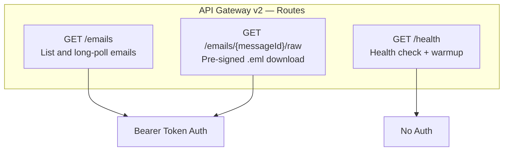
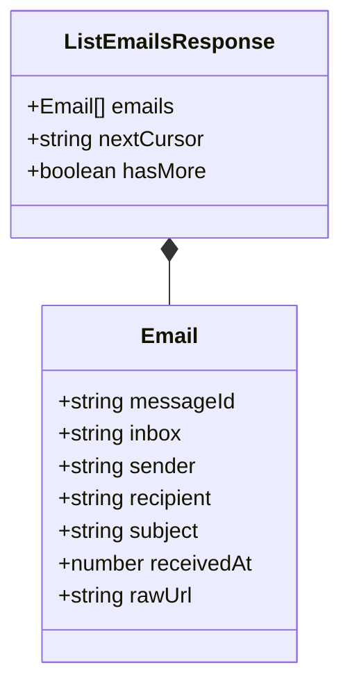
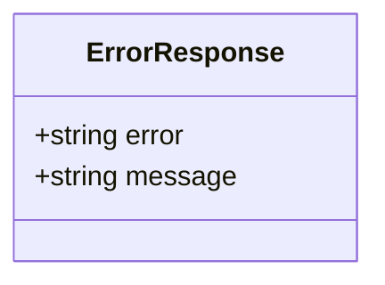
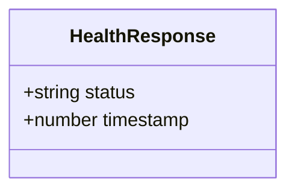
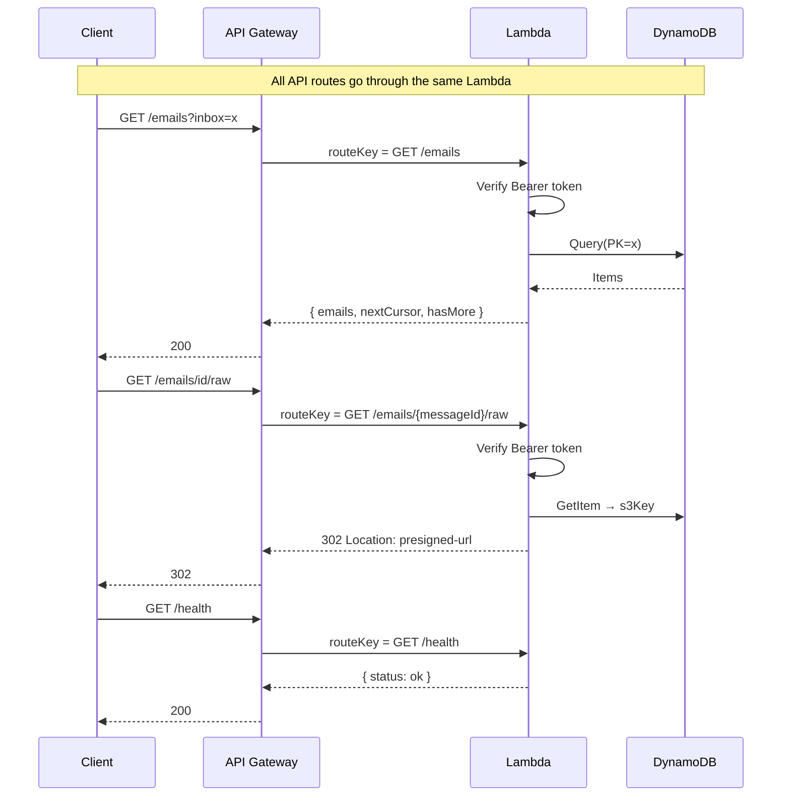

# API Contract

## Route Map

---

## `GET /emails`

Query emails for an inbox. Supports standard poll and long-poll.

### Query Parameters

| Param | Type | Required | Default | Description |
| --- | --- | --- | --- | --- |
| `inbox` | string | yes | — | Inbox identifier (local part of email address) |
| `wait` | boolean | no | `false` | Enable long-poll mode |
| `timeout` | number | no | `28` | Long-poll max wait in seconds (max: 28) |
| `cursor` | string | no | — | Pagination cursor (SK of last item) |
| `limit` | number | no | `50` | Max items per page (max: 100) |

### Response `200 OK`

### Errors

| Status | Error Code | Condition |
| --- | --- | --- |
| `400` | `MISSING_INBOX` | Missing `inbox` query parameter |
| `400` | `INVALID_INBOX` | Inbox contains invalid characters |
| `400` | `INVALID_LIMIT` | Limit out of range (1-100) |
| `401` | `UNAUTHORIZED` | Missing, invalid, or expired bearer token |
| `429` | `RATE_LIMITED` | Too many requests |

### Error Shape

---

## `GET /emails/{messageId}/raw`

Returns a `302` redirect to a pre-signed S3 URL for the raw `.eml` file. Pre-signed URL expires in **15 minutes**.

### Response

`302 Found` with `Location` header pointing to the pre-signed S3 URL.

### Errors

| Status | Error Code | Condition |
| --- | --- | --- |
| `401` | `UNAUTHORIZED` | Bad or expired bearer token |
| `404` | `NOT_FOUND` | messageId not found in DynamoDB |

---

## `GET /health`

No auth required. Used for health checks and Lambda warmup.

### Response `200 OK`

---

## Request / Response Flow

