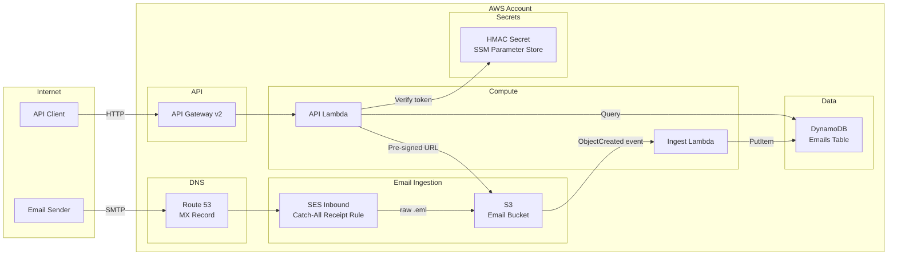

# System Architecture

## High-Level Architecture

## Component Summary

| Component | Type | Purpose |
| --- | --- | --- |
| Route 53 | DNS | MX record for `receive.yourdomain.com` → SES |
| SES Inbound | Email | Catch-all receipt rule → S3 |
| Email Bucket (S3) | Storage | Raw `.eml` files, 8-day lifecycle |
| Emails Table (DynamoDB) | Index | Email metadata, 7-day TTL |
| Ingest Lambda | Compute | S3 event → extract headers → DynamoDB write |
| API Lambda | Compute | Query, long-poll, pre-signed URL generation |
| API Gateway v2 | API | HTTP routes for email queries |
| HMAC Secret | Secret | SST Secret (SSM) for token signing key |
