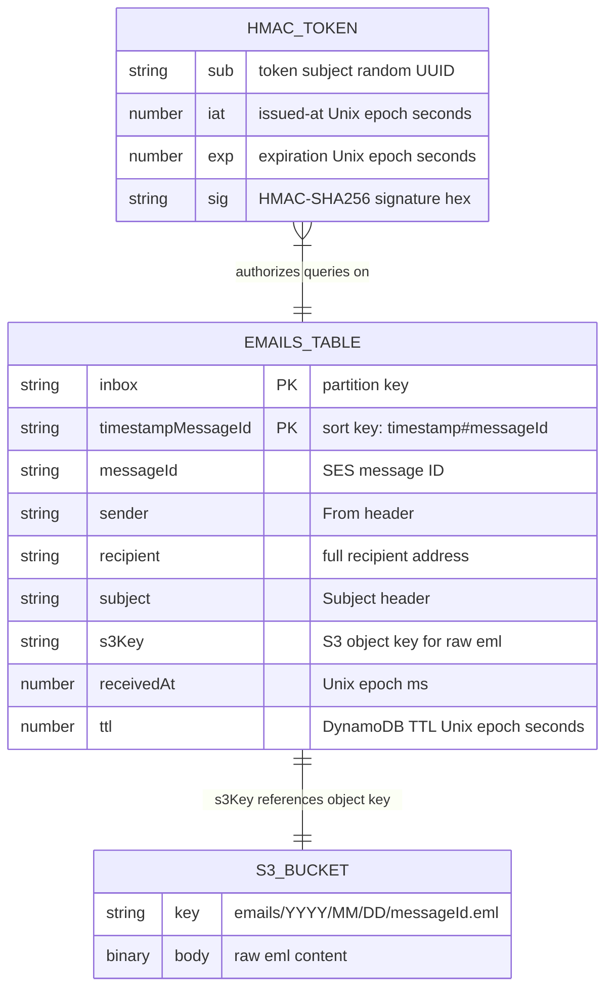
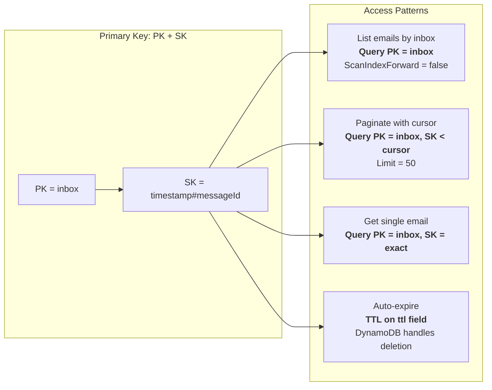
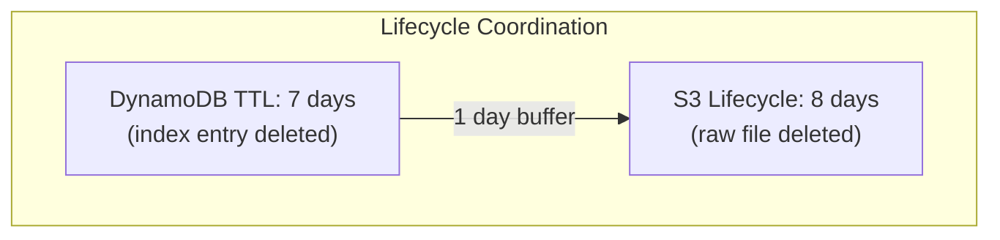

# Data Model

## ERD



## DynamoDB Table Design

**Table:** `EmailsTable`

| Attribute | Type | Key | Description |
|-----------|------|-----|-------------|
| `PK` | String | Hash | Inbox identifier (local part of email address) |
| `SK` | String | Range | `{ISO timestamp}#{messageId}` for lexicographic ordering |
| `messageId` | String | — | SES message ID |
| `sender` | String | — | `From` header value |
| `recipient` | String | — | Full recipient address |
| `subject` | String | — | `Subject` header value |
| `s3Key` | String | — | S3 object key |
| `receivedAt` | Number | — | Unix epoch milliseconds |
| `ttl` | Number | TTL | Unix epoch seconds (7 days from ingestion) |

### Sort Key Format

```
SK = "2024-03-10T12:30:00.000Z#abc123def456"
       ^--- ISO 8601 timestamp    ^--- SES messageId
```

Lexicographic ordering on SK gives newest-first when queried with `ScanIndexForward: false`.

### Access Patterns



## S3 Key Format

```
emails/{YYYY}/{MM}/{DD}/{messageId}.eml
```

Date-partitioned for lifecycle management and human readability. SES deposits the raw `.eml` — no transformation.

## Lifecycle Coordination



- DynamoDB TTL removes the index entry at **7 days**
- S3 lifecycle removes the raw `.eml` at **8 days**
- The 1-day buffer prevents: index exists → pre-signed URL generated → S3 object already gone
- Once the index is deleted, no new pre-signed URLs can be generated, so the S3 object is safely orphaned for 1 day
