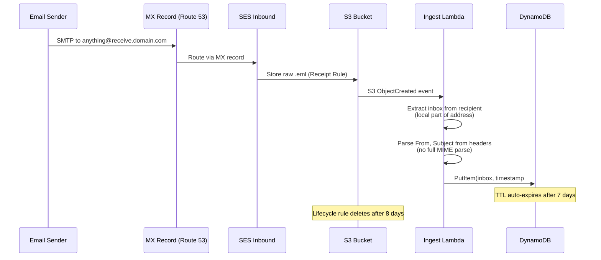
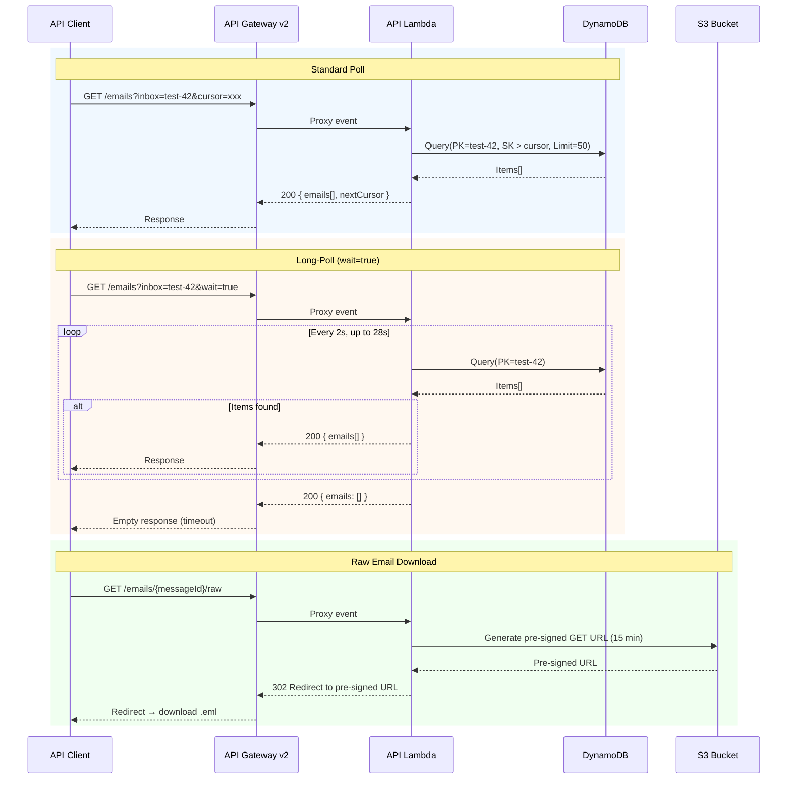
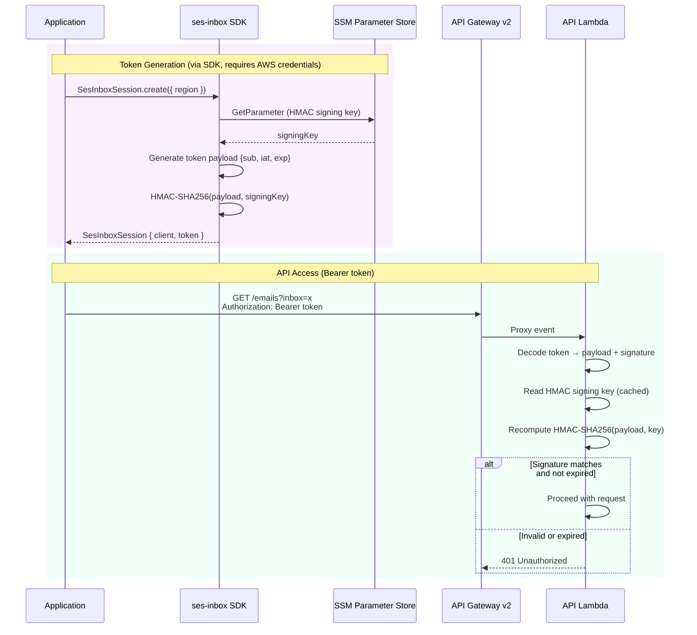
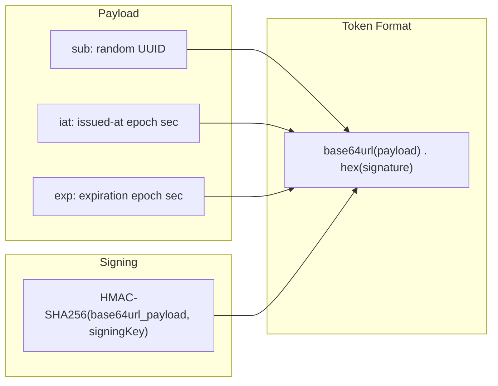

# Flows

## Email Ingestion Flow

## Query & Long-Poll Flow

## Auth Flow

## HMAC Token Structure

**Signing steps:**

1. Encode payload as base64url: `{ sub, iat, exp }`
2. Sign the base64url string with HMAC-SHA256 using the signing key
3. Token = `{base64url_payload}.{hex_signature}`

**Verification (no DB lookup):**

1. Split token on `.` → `payload`, `signature`
2. Recompute `HMAC-SHA256(payload, signingKey)`
3. Constant-time compare with `signature`
4. Decode payload, check `exp > now`
