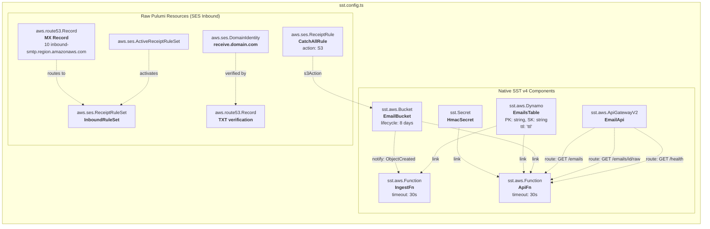

# Infrastructure (SST v4)

## Resource Graph

## Resource Configuration

| Resource | SST/Pulumi Type | Key Config |
| --- | --- | --- |
| EmailBucket | `sst.aws.Bucket` | Lifecycle expiration: 8 days, notify on `ObjectCreated`, filter prefix: `incoming/` |
| EmailsTable | `sst.aws.Dynamo` | Fields: PK (string), SK (string). Primary index: hashKey=PK, rangeKey=SK. TTL field: `ttl` |
| EmailApi | `sst.aws.ApiGatewayV2` | Routes: `GET /emails`, `GET /emails/{messageId}/raw`, `GET /health` |
| IngestFn | `sst.aws.Function` | Timeout: 30s. Links: EmailsTable |
| ApiFn | `sst.aws.Function` | Timeout: 30s. Links: EmailsTable, EmailBucket, HmacSecret |
| HmacSecret | `sst.Secret` | HMAC signing key, set via `sst secret set` |
| DomainIdentity | `aws.ses.DomainIdentity` | Domain: `receive.yourdomain.com` |
| DomainVerification | `aws.route53.Record` | TXT record: `_amazonses.{domain}` with verification token |
| MxRecord | `aws.route53.Record` | MX record: `10 inbound-smtp.{region}.amazonaws.com`, TTL 300 |
| InboundRuleSet | `aws.ses.ReceiptRuleSet` | Rule set name: `ses-inbox-inbound` |
| ActiveRuleSet | `aws.ses.ActiveReceiptRuleSet` | Activates InboundRuleSet |
| CatchAllRule | `aws.ses.ReceiptRule` | Catch-all, scan enabled, S3 action to EmailBucket with prefix `incoming/` |

## IAM Permissions (auto-wired by SST `link`)

| Function | Resource | Permissions |
| --- | --- | --- |
| IngestFn | EmailsTable | `dynamodb:PutItem` |
| ApiFn | EmailsTable | `dynamodb:Query`, `dynamodb:GetItem` |
| ApiFn | EmailBucket | `s3:GetObject` (for pre-signed URLs) |
| ApiFn | HmacSecret | Read (auto via SST Secret link) |

## SDK IAM Requirements

The SDK generates tokens client-side by reading the HMAC secret directly from SSM. The caller's IAM role needs:

| Permission | Resource | Purpose |
| --- | --- | --- |
| `ssm:GetParameter` | HMAC secret parameter ARN | Read signing key to generate tokens |

## SES Inbound — Why Raw Pulumi?

SST v4's `sst.aws.Email` component only supports **outbound** email (domain identity + DKIM + configuration sets). There is no built-in support for:

- SES receipt rule sets
- SES receipt rules (inbound catch-all → S3)
- Active receipt rule set activation
- MX record creation

These are created using raw `aws.ses.*` and `aws.route53.*` Pulumi resources directly in `sst.config.ts`. This is a supported pattern in SST v4 — any Pulumi resource can coexist with SST components.

## Outputs

| Output | Description |
| --- | --- |
| `apiUrl` | API Gateway endpoint URL |
| `bucketName` | S3 bucket name for raw emails |
| `tableName` | DynamoDB table name |
