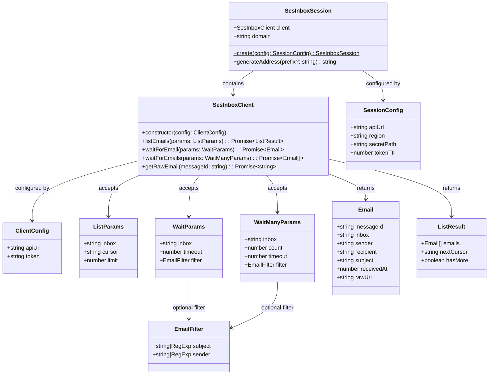
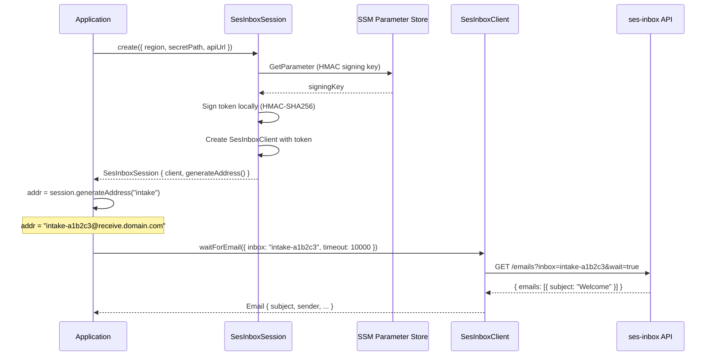

# SDK Public API

## Class Diagram

## Session Flow

`SesInboxSession.create()` reads the HMAC signing key from SSM, generates a token locally, and returns a session with an authenticated client.

## Two Entry Points

| Entry Point | When to Use |
| --- | --- |
| `SesInboxSession.create()` | Auto-provisions a token by reading the HMAC secret from SSM. Requires AWS credentials. |
| `new SesInboxClient()` | Bring your own token. Plain HTTP client, no AWS SDK dependency. |

## Method Reference

| Method | Description |
| --- | --- |
| `listEmails(params)` | Query emails for an inbox. Cursor-based pagination. |
| `waitForEmail(params)` | Long-polls until a single matching email arrives or timeout. |
| `waitForEmails(params)` | Long-polls until `count` matching emails arrive or timeout. |
| `getRawEmail(messageId)` | Returns pre-signed S3 URL for the raw `.eml` file. |
| `generateAddress(prefix?)` | Generates a unique email address under the configured domain. |
